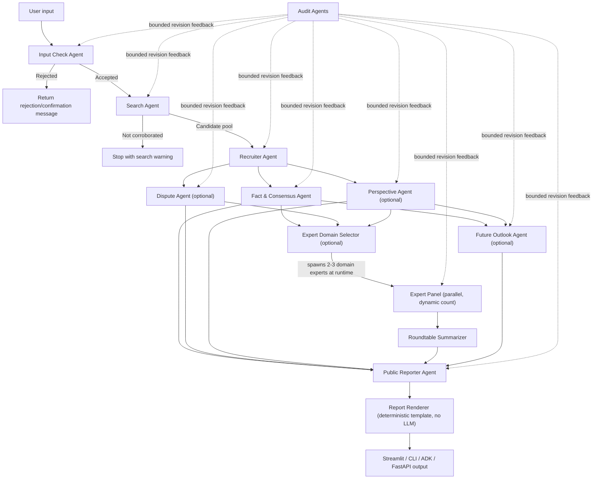

# NewsLens Multi-Agent News Analysis

NewsLens is a Python/ADK project that turns a news topic, headline, URL, or article text into a multi-source briefing. It searches live news results, deduplicates likely reprints, checks whether enough distinct sources exist, runs specialized analysis agents, and renders the result through Streamlit, CLI, ADK Playground, or an ADK FastAPI server.

The project is intended for learning and experimentation only, not commercial use.

## What It Does

| Capability | Current implementation |
| --- | --- |
| Input check | Validates user input and returns one of four actions: Accept, Accept with notification, Reject with confirmation, or Convert. |
| Live search | Uses DuckDuckGo via `ddgs`, falls back from news search to text search, and builds a candidate pool of up to 40 raw results. |
| Deduplication | Removes duplicate URLs and collapses likely wire-service or reprint clusters before analysis. |
| Article enrichment | Scrapes selected articles with Jina Reader first, then BeautifulSoup/lxml as a fallback. |
| Source analysis | Classifies article-level bias/framing and tone neutrality, and preserves source-balance metadata. |
| Modular agents | Recruits dispute, perspective, expert, and future-outlook agents only when the topic appears to need them. |
| Dynamic expert panel | The Expert Agent selects 2-3 relevant professional domains at runtime, then spawns exactly that many domain-expert agents in parallel and synthesizes a roundtable summary. |
| Audit loop | Runs per-stage audit agents with bounded revision cycles (tiered by risk) and surfaces unresolved warnings. |
| Public output | Produces a concise public report, a folded dashboard report assembled by a deterministic renderer (no LLM call), and a Streamlit dashboard with Analysis Details, Briefing, and collapsed trust diagnostics. |

## Architecture

Two stages decide their own shape at runtime instead of following a fixed pipeline: the **Recruiter Agent** skips the Dispute/Perspective/Expert/Outlook agents entirely for low-complexity topics, and the **Expert Agent** first picks 2-3 relevant domains for the story, then spawns exactly that many parallel domain-expert agents (identity and count are not fixed at build time). That adaptive team assembly, not the raw agent count, is the point of the multi-agent design here.



## Project Structure

```text
hackathon/
├── agents/
│   ├── agent.py                  # ADK root agent
│   ├── coordinator.py            # Pipeline orchestration, audits, retries, pause/stop state
│   ├── fast_api_app.py           # ADK FastAPI server entrypoint used by Docker/tests
│   ├── search_agent.py           # Search, dedupe, source classification
│   ├── web_tools.py              # Shared scrape/search tool functions (Jina Reader + BS4, DDGS)
│   ├── input_check_agent.py      # Input check and query repair
│   ├── recruiter_agent.py        # Optional module selection
│   ├── fact_agent.py             # Consensus facts and timeline
│   ├── dispute_agent.py          # Contested claims
│   ├── bias_agent.py             # Perspective and narrative profiling
│   ├── expert_agent.py           # Reference-grounded expert panel (dynamic domain fan-out)
│   ├── outlook_agent.py          # Future scenarios and monitoring indicators
│   ├── public_reporter_agent.py  # Public-facing summary
│   ├── report_renderer.py        # Deterministic folded Markdown report (no LLM call)
│   ├── evidence_verifier.py      # Deterministic evidence/citation checks
│   ├── schemas.py                # Pydantic output contracts
│   └── app_utils/                # Runtime metrics, local snapshots, telemetry, API typing
├── tests/
│   ├── unit/                     # Schema and helper tests
│   ├── integration/              # ADK agent and FastAPI server tests
│   └── eval/                     # Evaluation configs and sample datasets
├── app.py                        # Streamlit dashboard with analysis tabs, briefing, and diagnostics
├── main.py                       # Rich CLI entrypoint
├── Dockerfile                    # FastAPI/ADK container entrypoint
├── agents-cli-manifest.yaml      # Agents CLI project metadata
├── pyproject.toml                # Dependencies and tool config
└── uv.lock                       # Locked dependency graph
```

Generated folders such as `.venv/`, `__pycache__/`, `.pytest_cache/`, `.ruff_cache/`, `.adk/`, and `artifacts/` are ignored and should not be committed.

## Setup

Prerequisites:

- Python 3.11 through 3.13
- `uv`
- A Gemini API key from [Google AI Studio](https://aistudio.google.com/app/api-keys)

```bash
uv sync
echo "GEMINI_API_KEY=your_key_here" > .env
```

`GOOGLE_API_KEY` is also accepted. The app maps it to `GEMINI_API_KEY` when needed.

## Run

Streamlit dashboard:

```bash
uv run streamlit run app.py
```

CLI:

```bash
uv run python main.py --topic "Federal Reserve interest rate decision"
```

ADK FastAPI server:

```bash
uv run uvicorn agents.fast_api_app:app --host 0.0.0.0 --port 8080
```

ADK Playground, after installing the Agents CLI:

```bash
uv tool install google-agents-cli
agents-cli playground
```

## Streamlit Dashboard

The current dashboard uses a two-column demo layout:

| Area | Content |
| --- | --- |
| Analysis details | Three tabs: Sources; Facts, Disputes & Perspectives; Expert & Outlook. |
| Briefing | Public summary, TL;DR, key takeaways, narrative synthesis, and next-watch items. |
| Workflow sidebar | Progress stepper, pause/resume/stop controls, and execution logs. |
| Why trust this analysis? | Collapsed diagnostics with run metrics, audit summary, evidence-verifier summaries, restored snapshot metadata, and a clear-saved-runs control. |

The previous Q&A surface has been removed. Local display snapshots are saved under `.newslens_runs/` by default so a browser refresh can restore the latest completed or interrupted analysis without resuming backend execution.

## Test And Lint

```bash
uv run ruff check .
uv run pytest tests/unit tests/integration
```

Optional evaluation workflow:

```bash
agents-cli eval generate --dataset tests/eval/datasets/news-eval.json
agents-cli eval grade --config tests/eval/eval_config.yaml
```

## Configuration

- `GEMINI_API_KEY` or `GOOGLE_API_KEY`: required for live agent runs.
- `CURRENT_MODEL`: set internally by the coordinator from the selected model. The Streamlit selector currently defaults to Gemma 4; non-UI coordinator calls fall back to `gemini-3.1-flash-lite` unless a caller passes a model.
- `LOGS_BUCKET_NAME`: optional GCS bucket for ADK artifact/telemetry paths in deployed environments.
- `ALLOW_ORIGINS`: optional comma-separated CORS allowlist for the FastAPI app.

## Capstone Rubric Coverage

| Category | Status | Where |
| --- | --- | --- |
| Multi-agent systems | Done | `agents/coordinator.py` orchestrates 10+ specialist agents with runtime-decided fan-out: the Recruiter Agent adaptively skips agents for simple topics, and the Expert Agent spawns a variable-size parallel domain-expert panel (see Architecture above). |
| Deployability | Done | `Dockerfile` + `agents/fast_api_app.py` (ADK FastAPI server); no API keys committed, read from environment/`.env`. |
| Security features | Partial | See Security Notes below; scraped/searched external content is treated as untrusted input, but no formal SSRF/prompt-injection hardening yet. |
| Antigravity | Not used | N/A for this submission. |
| Agent skills | N/A | Not applicable to this ADK-based submission. |

## Security Notes

- Do not commit `.env` or API keys.
- Live search and scraping fetch external web pages; outputs should be reviewed before use.
- The system surfaces audit warnings when an agent output is not fully approved.
