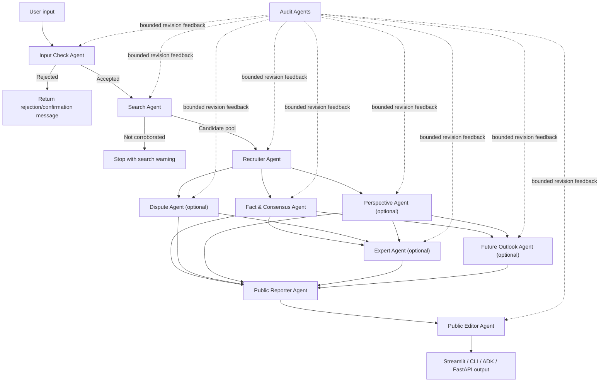

# NewsLens Multi-Agent News Analysis

NewsLens is a Python/ADK project that turns a news topic, headline, URL, or article text into a multi-source briefing. It searches live news results, deduplicates likely reprints, checks whether enough distinct sources exist, runs specialized analysis agents, and renders the result through Streamlit, CLI, ADK Playground, or an ADK FastAPI server.

The project is intended for learning and experimentation only, not commercial use.

## What It Does

| Capability | Current implementation |
| --- | --- |
| Input review | Validates user input and returns one of four actions: Accept, Accept with notification, Reject with confirmation, or Convert. |
| Live search | Uses DuckDuckGo via `ddgs`, falls back from news search to text search, and builds a candidate pool of up to 40 raw results. |
| Deduplication | Removes duplicate URLs and collapses likely wire-service or reprint clusters before analysis. |
| Article enrichment | Scrapes selected articles with Jina Reader first, then BeautifulSoup/lxml as a fallback. |
| Source analysis | Classifies article-level bias/framing, source reliability, media scale, and objectivity. |
| Modular agents | Recruits dispute, perspective, expert, and future-outlook agents only when the topic appears to need them. |
| Audit loop | Runs per-stage audit agents with bounded revision cycles and surfaces unresolved warnings. |
| Public output | Produces a concise public report, a folded editor report, a 7-tab Streamlit dashboard, and optional follow-up Q&A. |

## Architecture



## Project Structure

```text
hackathon/
├── agents/
│   ├── agent.py                  # ADK root agent
│   ├── coordinator.py            # Pipeline orchestration, audits, retries, pause/stop state
│   ├── fast_api_app.py           # ADK FastAPI server entrypoint used by Docker/tests
│   ├── search_agent.py           # Search, dedupe, source classification
│   ├── scraper.py                # Jina Reader + BeautifulSoup article scraping
│   ├── review_agent.py           # Input review and query repair
│   ├── recruiter_agent.py        # Optional module selection
│   ├── fact_agent.py             # Consensus facts and timeline
│   ├── dispute_agent.py          # Contested claims
│   ├── bias_agent.py             # Perspective and narrative profiling
│   ├── expert_agent.py           # Reference-grounded expert panel
│   ├── outlook_agent.py          # Future scenarios and monitoring indicators
│   ├── public_reporter_agent.py  # Public-facing summary
│   ├── public_editor_agent.py    # Consolidated folded Markdown report
│   ├── qa_agent.py               # Follow-up Q&A for completed reports
│   ├── evidence_verifier.py      # Deterministic evidence/citation checks
│   ├── schemas.py                # Pydantic output contracts
│   └── app_utils/                # Telemetry and API typing helpers
├── tests/
│   ├── unit/                     # Schema and helper tests
│   ├── integration/              # ADK agent and FastAPI server tests
│   └── eval/                     # Evaluation configs and sample datasets
├── app.py                        # Streamlit dashboard with 7 tabs
├── main.py                       # Rich CLI entrypoint
├── Dockerfile                    # FastAPI/ADK container entrypoint
├── agents-cli-manifest.yaml      # Agents CLI project metadata
├── pyproject.toml                # Dependencies and tool config
└── uv.lock                       # Locked dependency graph
```

Generated folders such as `.venv/`, `__pycache__/`, `.pytest_cache/`, `.ruff_cache/`, `.adk/`, and `artifacts/` are ignored and should not be committed.

## Setup

Prerequisites:

- Python 3.11 through 3.13
- `uv`
- A Gemini API key from [Google AI Studio](https://aistudio.google.com/app/api-keys)

```bash
uv sync
echo "GEMINI_API_KEY=your_key_here" > .env
```

`GOOGLE_API_KEY` is also accepted. The app maps it to `GEMINI_API_KEY` when needed.

## Run

Streamlit dashboard:

```bash
uv run streamlit run app.py
```

CLI:

```bash
uv run python main.py --topic "Federal Reserve interest rate decision"
```

ADK FastAPI server:

```bash
uv run uvicorn agents.fast_api_app:app --host 0.0.0.0 --port 8080
```

ADK Playground, after installing the Agents CLI:

```bash
uv tool install google-agents-cli
agents-cli playground
```

## Streamlit Tabs

The dashboard renders these 7 tabs:

| Tab | Content |
| --- | --- |
| Briefing | Public summary, key takeaways, folded editor report, and recruitment decision. |
| Sources | Search verification, source balance, reliability/objectivity scores, and article catalog. |
| Facts & Timeline | Consensus facts, evidence trails, and chronological events. |
| Perspectives & Disputes | Contested claims and narrative/perspective profiles. |
| Expert & Outlook | Expert roundtable output and future scenarios. |
| Audit Trail | Per-agent approval/rejection logs and unresolved warnings. |
| Q&A | Follow-up chat grounded in the completed report context. |

## Test And Lint

```bash
uv run ruff check .
uv run pytest tests/unit tests/integration
```

Optional evaluation workflow:

```bash
agents-cli eval generate --dataset tests/eval/datasets/news-eval.json
agents-cli eval grade --config tests/eval/eval_config.yaml
```

## Configuration

- `GEMINI_API_KEY` or `GOOGLE_API_KEY`: required for live agent runs.
- `CURRENT_MODEL`: set internally by the coordinator from the selected model; defaults to `gemini-3.1-flash-lite`.
- `LOGS_BUCKET_NAME`: optional GCS bucket for ADK artifact/telemetry paths in deployed environments.
- `ALLOW_ORIGINS`: optional comma-separated CORS allowlist for the FastAPI app.

## Security Notes

- Do not commit `.env` or API keys.
- Live search and scraping fetch external web pages; outputs should be reviewed before use.
- The system surfaces audit warnings when an agent output is not fully approved.
